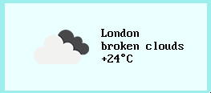

# 9weather
weather widget for 9front that uses the [OpenWeatherMap API](https://openweathermap.org/).

## Keyboard shortcuts
q / Del to quit

## Usage
In order to use 9weather you must obtain a free API key from OpenWeatherMap.

	usage: 9weather [-d delay] [-i] [-z zip,country] [-f font] [-k apikey]

The free plan allows the user to fetch data 2000 times per day which
should be sufficient for every day use.

You need to supply your api key via the `-k` flag.

The default delay between each pull is 5 minutes, this can be changed
with the `-d` flag.  Note that this delay is in seconds.

The default behaviour is to display the temperature in Celsius, this
can be changed by setting the `-i` flag (for imperial units).

## License
MIT
